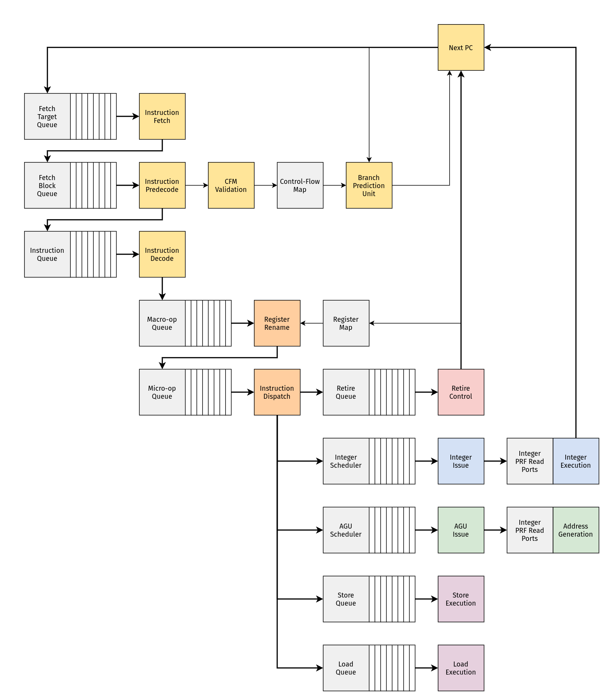

# Introduction

This project is a vehicle for exploring the following questions:

- How are modern [superscalar, out-of-order] microprocessors implemented?
- How do you create a behavioral description of these machines in RTL?
- What does it take to *physically* implement these machines? 

Currently, `ZNO` is a RISC-V machine designed around the RV32I base integer 
instruction set. This seemed like sufficient ground for exploring many
of the problems involved in the design of modern machines. 

## Rough Overview

The `ZNO` core is split into three pieces:

- The [frontend](./front/frontend.md) (for dealing with control-flow)
- The [midcore](./mid/midcore.md) (for managing state)
- The [backend](./back/backend.md) (for dealing with data-flow)



## About Chisel

`ZNO` is written in [Chisel](https://github.com/chipsalliance/chisel), 
an HDL embedded in Scala. Chisel internally represents designs with 
[FIRRTL](https://github.com/chipsalliance/firrtl-spec), which may be lowered
into other representations via [CIRCT](https://github.com/llvm/circt).

## Testing/Simulating the Design

Chisel also includes a framework for writing tests (`chiseltest`).
In the future, it will probably be necessary to explore other ways of
simulating and testing designs. 

```admonish note
Specifically, CIRCT's `arc` dialect provides a representation for simulating
circuits which can be lowered into LLVM IR! 

CIRCT provides an experimental tool (`arcilator`) for this, although FIRRTL 
needs to be lowered into the `hw` dialect for this to work.
At the moment, `arcilator` can be used to generate simple C++ bindings 
(see `tools/`arcilator` in the CIRCT tree for details on this).

It's easy to imagine that in the future, the FIRRTL dialect will be able to
represent user-defined types (Chisel bundles). Presumably at some point,
this information can be lowered into `hw` and used by `arc` (or other 
tooling) for creating a nice ergonomic interface to the simulated state.
```

